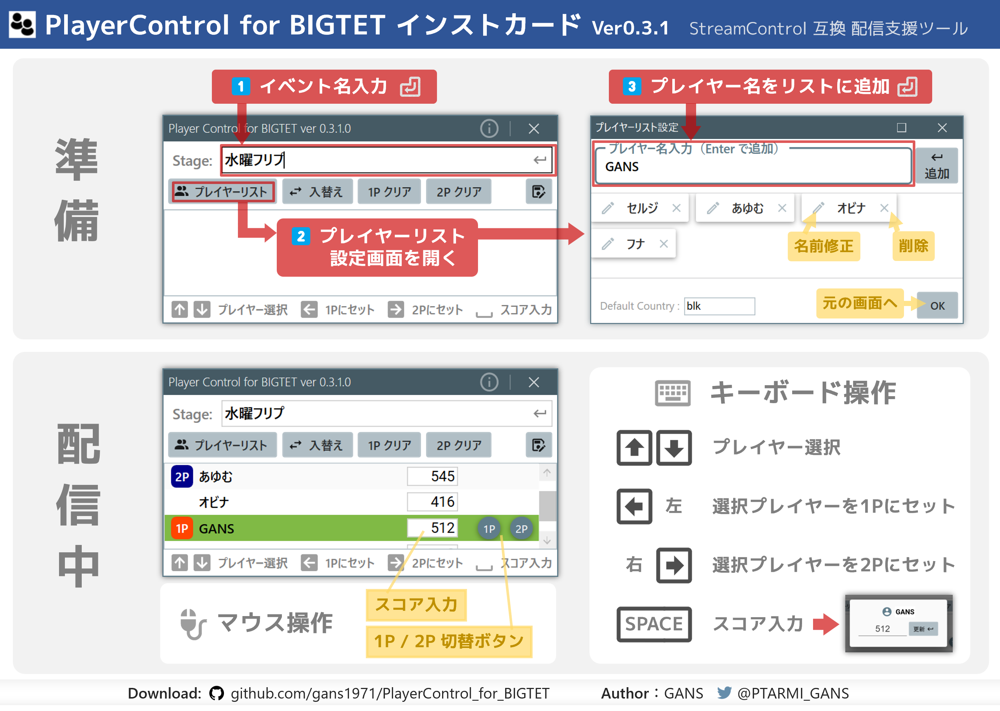

## PlayerControl for BIGTET

### 概要・特徴

- 対戦型ゲームの配信サポートツール <[StreamControl](http://streamcontroljapan.blog.jp/)> 互換のWindowsアプリ
- StreamControlとの共存・同時使用が可能
- TETRIS the Grandmaster ビッグモード（通称ビグテト）配信用にカスタマイズ
- プレイヤー名一覧を登録し、カーソルキーで 1P/2P ユーザー名・スコアを変更可能
- 3桁数値に特化したスコア入力画面

### ダウンロード

GitHub Releaseから [最新版ダウンロード](https://github.com/gans1971/PlayerControl_for_BIGTET/releases/)

### 動作環境

- Windows10 / 11
- 追加ランタイム不要（.NET6 自己完結型アプリ）

### セットアップ方法

- [セットアップ方法PDFダウンロード](/Manual/PlayerControlForBIGTET_Setup.pdf)
- ZIPファイル ⇛ PlayerControl_for_BIGTET フォルダ展開
- StreamControl テンプレートフォルダに展開したフォルダをコピー(StreamControl フォルダと同じ階層)

### 使い方

- 実行ファイルを直接起動：PlayerControl_for_BIGTETフォルダ - PlayerControl.exe
  - デスクトップ等にショートカットを作成してご利用ください
(/Manual/PlayerControlForBIGTET_InstCard_v0.3.1.pdf)

[インストカードPDFダウンロード](/Manual/PlayerControlForBIGTET_InstCard_v0.3.1.pdf)

## リリースノート

### ■ Ver0.3.1.0(2022/06/25)

- スコア入力時にフォーカスが背面に移動してしまう問題を修正
- プレイヤーコントロール:プレイヤーリスト設定画面ショートカット(Ctrl+P)
- プレイヤーリスト設定をモーダル化
- プレイヤーリスト設定:アイテムコンテナをWrapPanelに変更
- プレイヤーリスト設定:名前編集ダイアログを追加（直接編集廃止）
- プレイヤーリスト設定:クローズショートカット(CTRL+W or ESC)
- プレイヤーリスト設定:名前編集後同名プレイヤーが存在する場合は変更キャンセル
- ステージ入力コントロールに確定ボタンを追加

### ■ Ver0.3.0.0(2022/06/13)

- レイアウトを全面改修
- イベント名入力対応
- タイトルバー表示（バージョン番号付き）
- Ctrl + C で名前とスコアをクリップボードに登録
- DefaultCountryを設定
- ユーザーリストに直接スコア入力できるように修正
- 選択ユーザーの1P/2Pをマウスで設定できるように修正
- コンテキストメニューにクリップボード追加

### ■ Ver0.2.0.0(2022/06/11)
- ロケテ版（池袋大感謝祭用）
