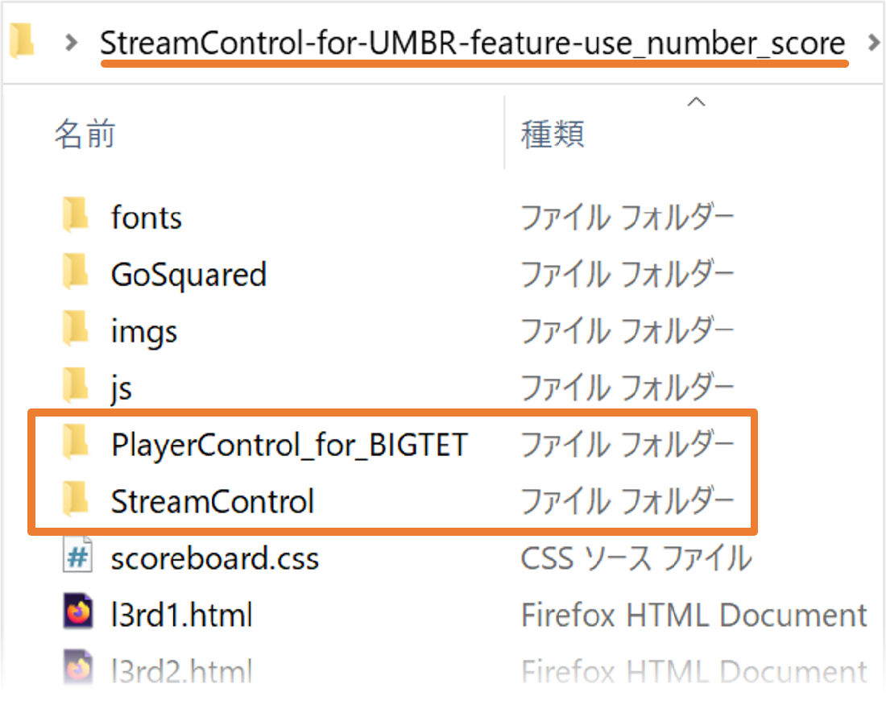

# PlayerControl for BIGTET

※ Ver0.3.4 操作イメージ映像

***カーソルキー上下で選択・左右で1P/2Pを設定・スペースキーでスコア入力***

※ 以下はVer 0.3.1 の資料です（最新版用マニュアルは作成中）

- [**インストカード PDF (A5版) ダウンロード**](/Manual/PlayerControlForBIGTET_InstCard_v0.3.1.pdf)
- [**セットアップ方法 PDF (A5版) ダウンロード**](/Manual/PlayerControlForBIGTET_Setup.pdf)

## 概要・特徴

- 対戦型ゲーム配信サポートツール <[**StreamControl**](http://streamcontroljapan.blog.jp/)> 互換 Windows アプリ
  - StreamControl との共存・同時使用が可能
- テトリス ザ・グランドマスタービッグモード（通称ビグテト）配信サポート用
- 対応テンプレート<[**SHIG : ウメブラSP向けテンプレート 数字版** (StreamControl-for-UMBR)](http://shigaming.com/2018/11/30/streamcontroltemplate2019/)> 
- プレイヤーが頻繁に入れ替わるフリープレイイベントやローリングマッチを想定- 
  - プレイヤーを一覧に登録
  - カーソルキーだけで プレイヤー選択 と 1P/2Pセット が操作可能
  - スコアは4桁半角数字のみ入力可能
  - 保存ボタンのクリック不要で即反映
  - アプリケーション or OS 強制終了した場合、次回起動時に入力情報を自動復元

## ダウンロード

[**リリース版ダウンロード**](https://github.com/gans1971/PlayerControl_for_BIGTET/releases/)

## 動作環境

- Windows10 / 11
  - 追加ランタイム不要（.NET6 自己完結型アプリ）
  - StreamControl 用 StreamControl-for-UMBR テンプレートがセットアップされている環境

## セットアップ方法

- 詳細は [**セットアップ方法 PDF**](/Manual/PlayerControlForBIGTET_Setup.pdf) 参照
- ZIPファイル展開 ⇨ *PlayerControl_for_BIGTET* フォルダ
- テンプレートフォルダ直下に *PlayerControl_for_BIGTET* フォルダをそのままコピー
  - ※　StreamControl アプリフォルダと同じ階層


## 削除方法

- StreamControl テンプレートフォルダから *PlayerControl_for_BIGTET* をフォルダごと削除
- アプリ内でレジストリは使用していない

## 使い方

- セットアップフォルダ内の **PlayerControl.exe** を直接実行
- よく使う場合はデスクトップ等にショートカットを作成
- 基本的な使用法は [**インストカード PDF (A5版)**](/Manual/PlayerControlForBIGTET_InstCard_v0.3.1.pdf) を参照

## アプリの挙動解説

- アプリ内でプレイヤーやスコアなどが変更されると…
  - 実行ファイルのパスの親を辿り、*scoreboard.html* ファイルが存在するフォルダを探す
  - そのフォルダにアプリで設定した内容を記述した *streamcontrol.json* を保存
  - ファイル保存後、*scoreboard.js* が json の変更を検知してHTMLに反映
  - 保存する度に *timestamp* を変更する点がポイント
- 保存しているJSONの書式

```json
{
 "stage": "水曜フリプ",
 "pName1": "ガンズ",
 "pName2": "NIM",
 "pScore1": "792",
 "pScore2": "998",
 "pTwitter1": "@PTARMI_GANS",
 "pTwitter2": "@NimTak",
 "pCountry1": "blk",
 "pCountry2": "blk",
 "timestamp": "1656151419511"
}
```

| プロパティ | サンプル値 | 解説 |
|:---|:---|:---|
|stage|"水曜フリプ" |大会・イベント名など中央に表示される文字</br>改行位置に\</br>タグを挿入</br>複数行時のフォントサイズ調整に \<font size=##> タグを設定|
|pName1|"ガンズ"|1P の名前 |
|pName2|"NIM"|2P の名前|
|pScore1|792 |1P のスコア（最大4桁の半角数字）|
|pScore2|999 |2P のスコア（最大4桁の半角数字）|
|pScore2|998 |2P のスコア（最大4桁の半角数字）|
|pTwitter1|@PTARMI_GANS|1P のサブ情報（twitterアカ等）|
|pTwitter2|@NimTak|2P のサブ情報（twitterアカ等）|
|pCountry1|"blk"| 国旗など（ビグテト配信専用 固定画像）|
|pCountry2|"blk"| 国旗など（ビグテト配信専用 固定画像）|
|timestamp|"1656151419511"| ファイル保存時刻(long)|


## リリースノート

### ■ Ver0.3.4.0(2023/0X/XX)
- スコアラベル機能追加（スコア上にラベル文字を表示・サイズ自動調整）
- プレイヤーのコンテキストメニューから、スコア入力・サブ情報設定を追加
- プレイヤーのコンテキストメニューから、プレイヤー削除を追加
- ステージ入力UIのレイアウトを調整
- プレイヤー一覧のスコア入力枠にスコアラベルを表示
- プレイヤー一覧のスコア入力枠で、IMEを有効化できないように変更
- プレイヤー一覧のスコア入力枠にサブ情報（twitter等）を更新可能に変更
- JSON保存時に保存ボタンがフラッシュアニメーションする表現を追加
- 各種テキストボックスにクリアボタンを追加

### ■ Ver0.3.3.0(2023/02/23)
- ユーザー設定にサブ情報（pTwitter1/pTwitter2）プロパティを追加
- ユーザー名再編集画面で、名前を変更せず確定すると同名警告が表示される問題を修正
- レイアウトを調整

### ■ Ver0.3.2.0(2023/02/12)
- スコアの最大入力桁数を4桁に拡張
- ステージ名の改行対応(Alt+Enter で改行)
  - 2行: FontSize = -1  
  - 3行以上: FontSize = -2  

### ■ Ver0.3.1.0(2022/06/25)
- プレイヤーコントロール:スコア入力時にフォーカスが背面に移動してしまう問題を修正
- プレイヤーコントロール:ステージ入力コントロールに確定ボタンを追加
- プレイヤーコントロール:プレイヤーリスト設定画面ショートカット(Ctrl+P)
- プレイヤーリスト設定をモーダル化
- プレイヤーリスト設定:アイテムコンテナをWrapPanelに変更
- プレイヤーリスト設定:名前編集ダイアログを追加（直接編集廃止）
- プレイヤーリスト設定:クローズショートカット(CTRL+W or ESC)
- プレイヤーリスト設定:名前編集後同名プレイヤーが存在する場合は変更キャンセル

### ■ Ver0.3.0.0(2022/06/13)

- レイアウトを全面改修
- イベント名入力対応
- タイトルバー表示（バージョン番号付き）
- Ctrl + C で名前とスコアをクリップボードに登録
- DefaultCountryを設定
- ユーザーリストに直接スコア入力できるように修正
- 選択ユーザーの1P/2Pをマウスで設定できるように修正
- コンテキストメニューにクリップボード追加

### ■ Ver0.2.0.0(2022/06/11)

- 初回ロケテ版

## 開発環境

- Visual Studio Community 2022
- プラットフォーム: .NET6 + WPF

## LICENSE

- MIT License

## 謝辞

- 動作検証用に [SHIG Website StreamControl テンプレート](http://shigaming.com/2018/11/30/streamcontroltemplate2019/) を使用いたしました。
  - githubリポジトリは [こちらです](https://github.com/Pon57/StreamControl-for-UMBR)
- *StreamControl* の挙動解析に [GitHubソースコード](https://github.com/farpenoodle/StreamControl) を参照しました。
